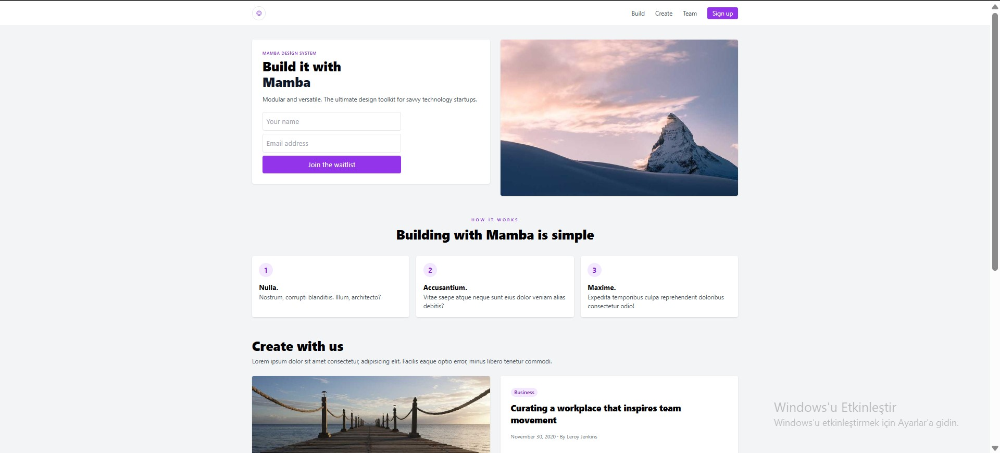

# TailwindCSS Landing Page

Bu proje, **TailwindCSS** kullanılarak hazırlanmış basit bir **Landing Page** (Açılış Sayfası) örneğidir. Eğitim amaçlı oluşturulmuş olup, temel HTML ve TailwindCSS yapısını öğrenmek isteyenler için uygundur.

## 📸 Sayfa Görseli


## 🚀 Özellikler
- **Responsive** (Mobil uyumlu) tasarım
- Üst menü (Navbar)
- Hero alanı (başlık, açıklama, form ve görsel)
- "How it works" bölümü (3 adım kartı)
- "Create with us" bölümü (yazı ve görsel)
- "Our team" bölümü (ekip tanıtım görseli)
- Footer

## 🛠 Kullanılan Teknolojiler
- **HTML**
- **TailwindCSS** (CDN versiyonu)
- Görseller için [picsum.photos](https://picsum.photos/)

## 📂 Kurulum
1. Bu projeyi klonlayın:
   ```bash
   git clone https://github.com/kullaniciadi/tailwind-landing-page.git
   ```
2. Proje klasörünü açın ve `index.html` dosyasını tarayıcıda çalıştırın.

## 📄 Lisans
Bu proje eğitim amaçlıdır. 
